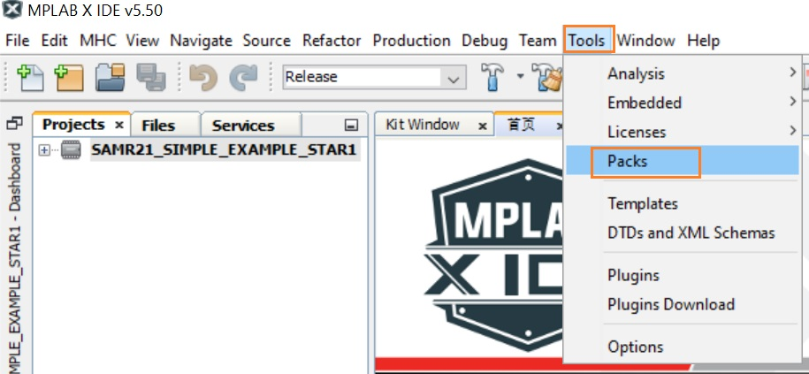
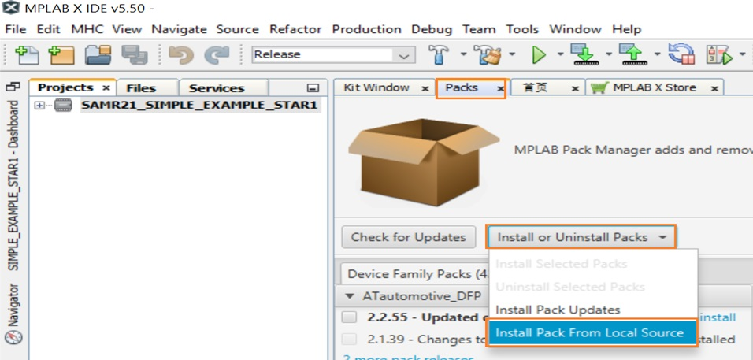
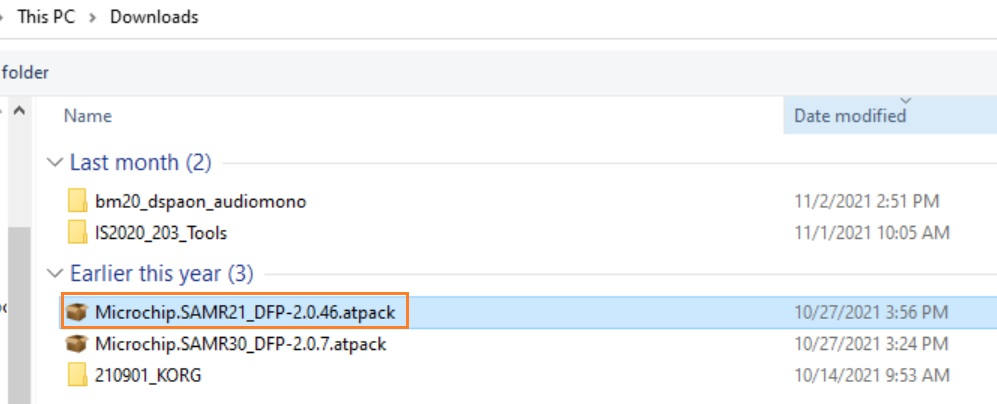
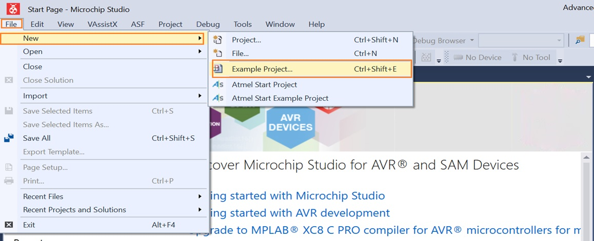
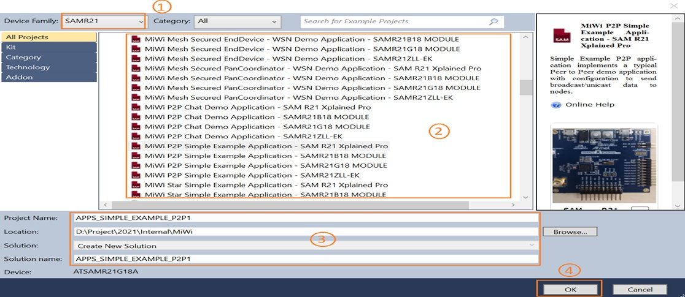
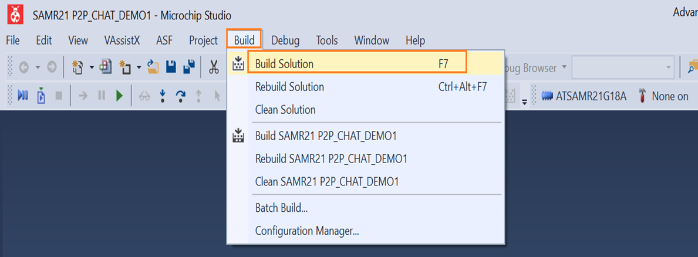
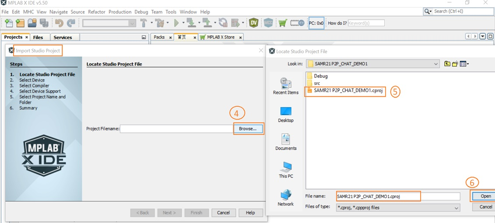
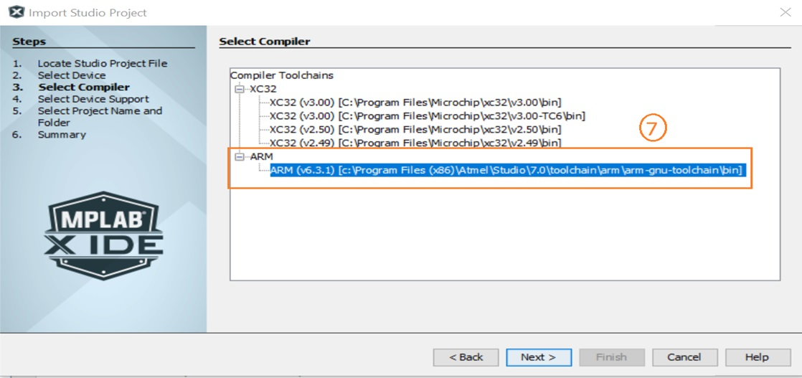
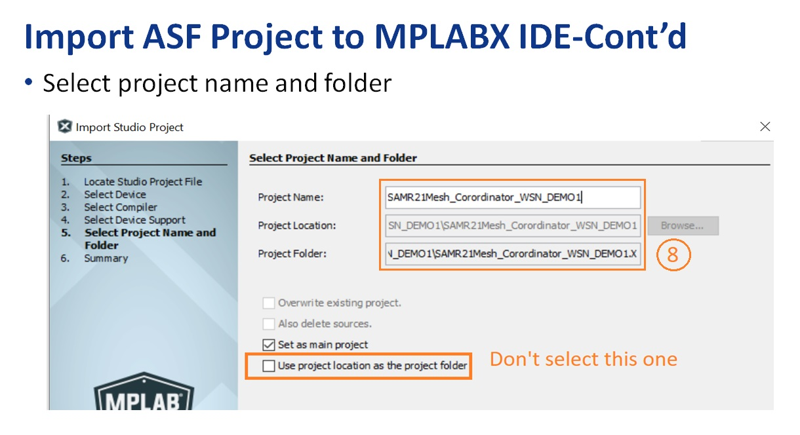
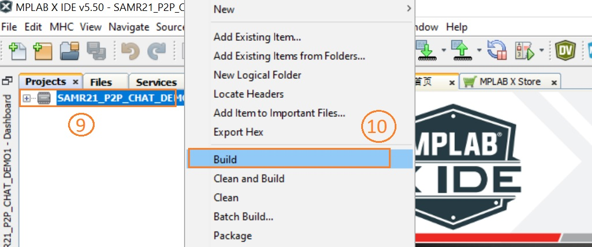

# Example code for importing ASF Project to MPLABX

> "Wireless Made Easy!"

Devices:  **ATSAMR21**

## ⚠ Disclaimer

<b>
THE SOFTWARE ARE PROVIDED "AS IS" AND GIVE A PATH FOR SELF-SUPPORT AND SELF-MAINTENANCE.  
This repository contains unsupported example code intended to help accelerate client product development. It is not validated for production nor audited for security best-practices.  
Note that while this repository is unsupported, Microchip welcome community contributions, and all pull-requests will be considered for inclusion into the repository.

</b>

> Interact with peers in the community at [MiWi Forum](https://www.microchip.com/forums/f507.aspx).

## Overview
This example demonstrates how to import an ASF project into MCHP MPLAB. This example is based on SAMR21 XPLAINED Xpro board, and verified on Microchip Studio v7.0 and MPLAB X v5.50,now let's go through the entire steps

## Import steps
### 1.Install SAMR21 Package
#### 1.1 Step 1
Launch MPLABX IDE, and go to tools menu, and click the Packs in the drop-down menu,refer to the picture below.

#### 1.2 Step 2
Click the Packs tab, and then select install pack from local source shown as below.

#### 1.3 Step 3
Using the navigation button to get the pack which you want to install.

### 2.Create ASF Project
#### Step 1:Create a new ASF project
   1. Launch Microchip Studio
   2. Go to File-->new, and then click Example Project

#### Step 2:Select existing ASF example project
&emsp;&emsp;Follow the steps below to create a new peoject

#### Step 3:Compile project
&emsp;&emsp;Compile the project you created

### 3.Import ASF project to MPLAB X
#### Step 1:Start importing
   1. Launch MPLABX
   2. Follow the steps below to import the ASF project

#### Step 2:Choose ASF project
&emsp;&emsp;Follow the steps below to import the ASF project which you created.

#### Step 3:Choose the compiler
&emsp;&emsp;Choose the compiler you need

#### Step 4:Generate MPLAB X project
&emsp;&emsp;Generate MPLAB X project

#### Step 4:Compile MPLAB X project
&emsp;&emsp;Compile the project you imported

### 4.Validate
Before you start validating your work,there are some steps to go through.

#### Install test tools
   1. Install JAVA 1.6.0.6

&emsp;&emsp;You can get the JAVA from the link below

&emsp;&emsp; https://filehippo.com/download_jre-32/history/

   2. Install WSN Monitor

&emsp;&emsp;You can get the JAVA from the link below
&emsp;&emsp; https://microchipsupport.force.com/s/article/WSNMonitor-Setup-files

#### Test
   1. Programing your device with the relative application.
   2. Power on your device.
   3. Press the SW0 button on SAMR21 X plained Pro EVB.
   4. Lanuch WSN Monitor, and then you will see the device which you are using on your PC.

